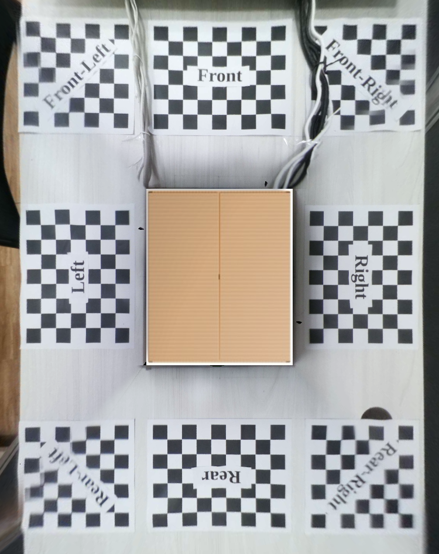

# How to Use
### Documentation please revert to this [link](https://mcut-my.sharepoint.com/:f:/g/personal/m07158031_o365_mcut_edu_tw/Enu7QLAPY15OkFzQuGQrBV4BK8BqS_Oq_2D-eVQ3WeZxSA?e=BCHNAt)

## 1. Clone this repository (branch)
```
git clone -b 03-11-2021 https://github.com/aji-ptn/Bird_view.git
```
## 2. Requirement
- Python >=3
- OpenCV
- Numpy
- os
- Moildev

## 3. There contain 2 main program to run this file
### 1. Projection matrix [link](get_projection_maps.py)

To get projection maps from undistorted image
### 2. Bird view [link](bird_view.py)
Combine all image and do stitching

## 4. Get map from projection view
This part contain code for get projection image from undistorted image.

### A. Set Up Alpha Beta and Zoom Factor
To get the value of alpha beta and zoom factor it can be done by using the Moilapp application. This is to make the process easier. for details please read the documentation.  
In this documentation, the alpha beta and zoom factor values have been prepared
```
front
    Alpha = -50.1
    Beta = 1.8
    Zoom factor = 4
Left Camera
    Alpha = -46.8
    Beta = -1
    Zoom factor = 3.5
Right Camera
    Alpha = -49.3 
    Beta = 0.1
    Zoom factor = 3.5
Rear Camera
    Alpha = -54.2 
    Beta = -2.8
    Zoom factor = 4
    
Note: This Value can be change depend with position of camera on car. once you get the value, you dont have to re-celculate again
```
to be able to change this value please open the file [link](get_projection_maps.py)


- **self.camera_name** : you can change to be:
```
front, rear, left, right
```
- **self.folder_path** : you can create new folder for saving you file, just file the name and inside of folder mush be include:
```
cutting : for save projection image
original : for storage original image. make sure the name is "front, rear, left and right"
undistortion : undistortion imag from calibration
yaml : for saving projection matrix
```
- **self.alpha, self.beta and self.zoom** : every image had different value, make sure you do get the right value. please read documentation for more information

### B. Undistorted Image from alpha beta and zoom
Run this program on your IDE
```
python get_projection_maps.py
```
### C. Select point on checkerboard
- Select point on checkerboard 
- make sure you click on the right position and right order. *0, 1, 2, 3*


Result Perspective view


Projection matrix, alpha, beta, zoom factor has been save in yaml file.


**Do the same this to other camera.**

### 2. Get Bird View
- After Finish all the proses above, you can move to another code **bird_view.py** [link](bird_view.py)
- Make sure the folder_path was same just like the get_projection_maps.


- type this command or run this proram
```
python bird_view.py
```



# end
Please read the documentation for more information. [link](https://mcut-my.sharepoint.com/:f:/g/personal/m07158031_o365_mcut_edu_tw/Enu7QLAPY15OkFzQuGQrBV4BK8BqS_Oq_2D-eVQ3WeZxSA?e=BCHNAt)
