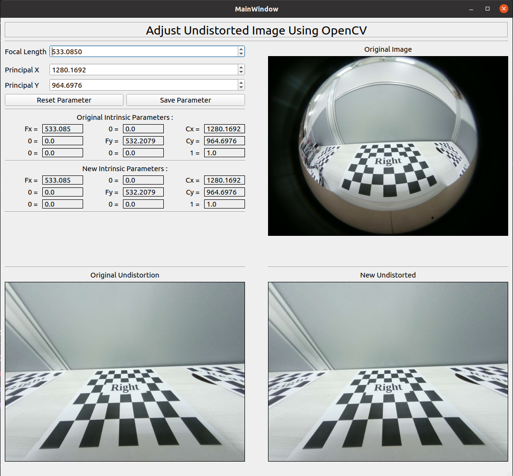
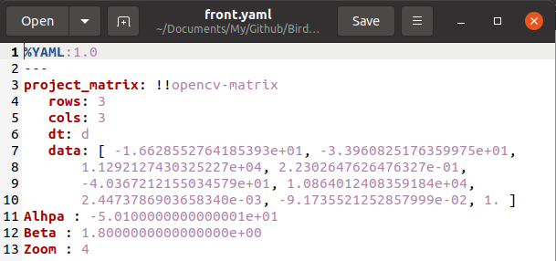

# Experiment of bird view 

### 1. Bird view Calibration
- **Outside Area** : the distance between the perspective area and the outer area that will be covered by the surrounding view​​
- **Perspective Area** : the area that gives the top-view image perspective
- **Inside area** : the distance between the car or box and the perspective area 
- **Car or Box** : to put the four cameras

### 2. Calibration Size
- Measurement the area that will be cover

### Final result

- On corner of perspective area still have distortion and fish eye camera had blind spot

## Documentation and Reference
1. Documentation [link](https://mcut-my.sharepoint.com/:f:/g/personal/m07158031_o365_mcut_edu_tw/Enu7QLAPY15OkFzQuGQrBV4BK8BqS_Oq_2D-eVQ3WeZxSA?e=WiieP1)
2. PPT result can download with [this link](https://mcut-my.sharepoint.com/:p:/g/personal/m07158031_o365_mcut_edu_tw/EVBQWUR2BYFDlz0jHPW9KWUB9NKGR-VVz2c0rxeNMCr7Jg?e=0mGOy7)
3. Original Code from Zhao Liang [neozhaoliang GitHub](https://github.com/neozhaoliang/surround-view-system-introduction)