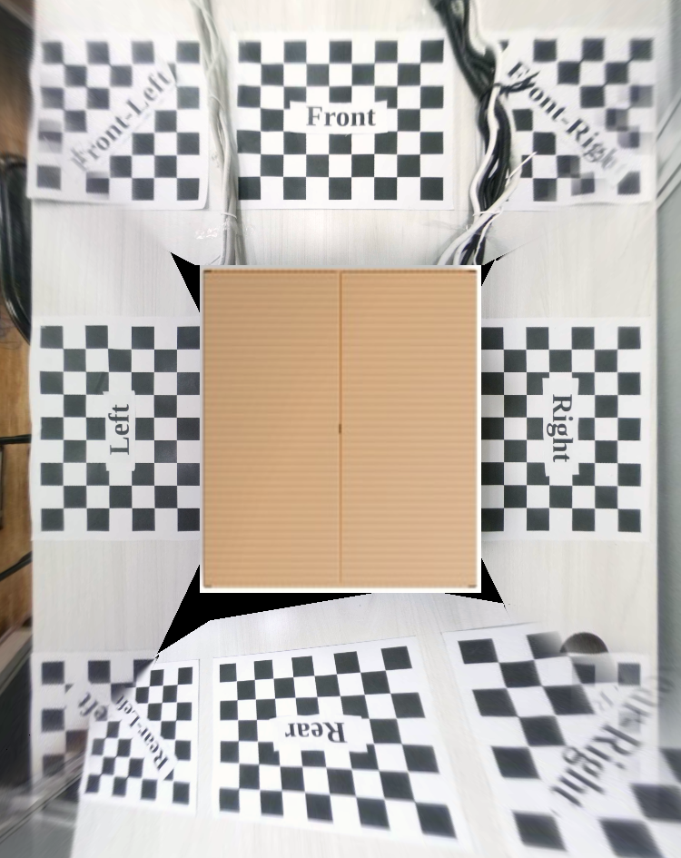
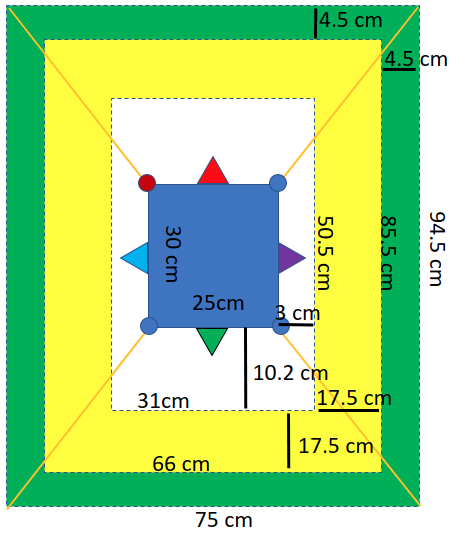
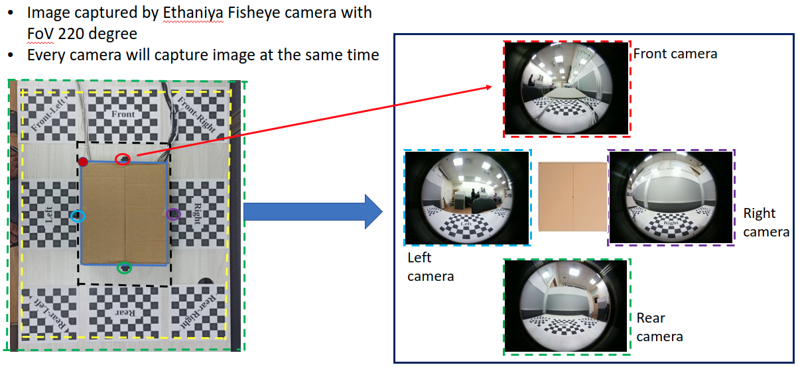
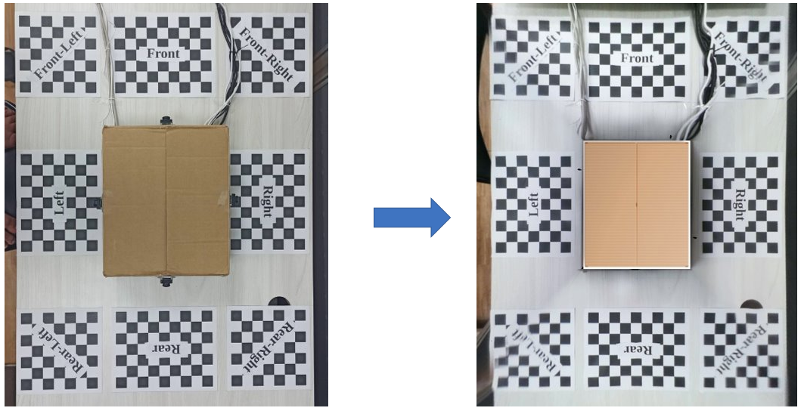

# Experiment of bird view 
Name : Aji

Documentation still progress for **11-11-2021 branch**
### How to use this code please refert to [This](How_to_Use_this_code.md)
### Previous Documentation please revert to this [link](https://mcut-my.sharepoint.com/:f:/g/personal/m07158031_o365_mcut_edu_tw/Enu7QLAPY15OkFzQuGQrBV4BK8BqS_Oq_2D-eVQ3WeZxSA?e=BCHNAt)

### Please open [*data*](data) folder to see all experiment
```
sixth = Third Experiment
Eleventh = Opencv Undistortion (Adjust Parameter(fourth experiment)) with image blending
Thirteen = Opencv Undistortion (Adjust Parameter(fourth experiment)) with overlapping image
Twelveth = MoilDev Undistortion (fourth experiment)
```
- result experiment without adjustment parameter (focal and principal point)



result **Eleventh** experimenter
- result experiment adjustment parameter (focal and principal point)
- using color blending for stitching image


result **thirteen** folder
- result experiment adjustment parameter (focal and principal point)
- using overlapping image for combine image
- documentation code for this experiment still development


### 1. Bird view Calibration
- **Outside Area** : the distance between the perspective area and the outer area that will be covered by the surrounding view​​
- **Perspective Area** : the area that gives the top-view image perspective
- **Inside area** : the distance between the car or box and the perspective area 
- **Car or Box** : to put the four cameras


## 2. Calibration Size
### A. Measurement the area Calibration



### B. Checkerboard size 
- Red Box
```
- Number of checkerboard is 7 x 7 (25 x 25 mm)

- Put on every corner of perspective area

- For Overlapping image (overlap image between two camera)
```
  - Blue Box
```
Number of checkerboard is 9 x 7 (25 X 25 mm)

Put on every front of camera (front, right, rear, left)

For Perspective image (for get perspective from above view)
```


- **Note** : Each checkerboard must have the same width

## 3. Capture Image
- Image captured by Ethaniya Fisheye camera with FoV 220 degree
- Every camera will capture image at the same time



## 4. Un-distortion Image
- Un-distortion image using anypoint mode 2
- Alpha = -65, Beta = 0, Zoom factor = 3.5


## 4. Perspective Transform
- Perspective Image for front image


- Change every image become above view


## Final result

- On corner of perspective area still have distortion and fish eye camera had blind spot



## Documentation and Reference
1. Documentation [link](https://mcut-my.sharepoint.com/:f:/g/personal/m07158031_o365_mcut_edu_tw/Enu7QLAPY15OkFzQuGQrBV4BK8BqS_Oq_2D-eVQ3WeZxSA?e=WiieP1)
2. PPT result [link](https://mcut-my.sharepoint.com/:p:/g/personal/m07158031_o365_mcut_edu_tw/EVBQWUR2BYFDlz0jHPW9KWUB9NKGR-VVz2c0rxeNMCr7Jg?e=0mGOy7)
3. Original Code from Zhao Liang [neozhaoliang GitHub](https://github.com/neozhaoliang/surround-view-system-introduction)